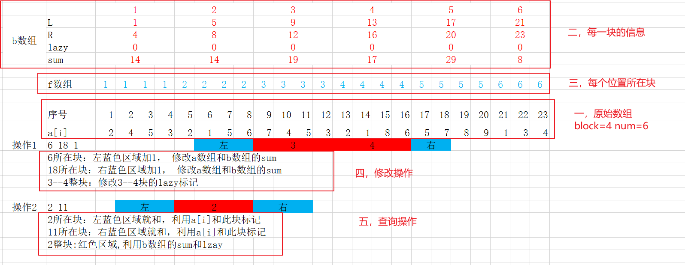

https://www.luogu.com.cn/problem/P3372

# 题意分析

给一个n个数的数列，m个操作，每个操作分两种1，2。

1：对数列x---y的位置加k

2：查询x---y的和

数据范围:$n, m<=10^5$, 结果在$[-2^{63}, 2^{63}]$也就是long long 类型范围

# 算法分析

- 暴力 直接模拟实现

```c++
#include <cstdio>
const int N = 110000;
long long a[N];
int n, m;
int main(){
	
	freopen("p3372.in", "r", stdin);
	
	scanf("%d%d", &n,&m);
	for (int i=1; i<=n; ++i) scanf("%lld", &a[i]);
	
	for (int i=1; i<=m; ++i){
		
		int x, y, op;
		long long k;
		scanf("%d", &op);
		if (op==1){
            //修改操作
			scanf("%d%d%lld", &x, &y, &k);
			for (int j=x; j<=y; ++j) a[j]+=k;
		}
		if (op==2){
            //查询操作
			scanf("%d%d", &x, &y);
			long long sum=0;
			for (int j=x; j<=y; ++j) sum+=a[j];
			printf("%lld\n", sum);
		}
	}
	
	return 0;
}
```

- 线段树

- 分块

  ## 定义

  > block：块的大小
  >
  > num：块数
  >
  > b数组：每块信息b, 块的左端点 块的右端点  块的标记  块的和
  >
  > f数组：每个位置所属块

  

  ## 修改操作 x y k

  1、x，y在同一个块，直接暴力累加注意更新块的和。

  2、x，y在不同块中。分三种情况 左部分  中间整块  右部分

  	- 左部分 x到x所在块的右端点 暴力处理注意更新块的和
  	- 右部分 x所在块的左端点到y 暴力处理注意更新块的和
  	- 中间整块，x所在块编号+1 到 y所在块-1, 修改这些块的标记

  ## 查询操作

  1、x，y在同一个块，直接暴力求和注意加标记。

  2、x，y在不同块中。分三种情况 左部分  中间整块  右部分

  	- 左部分 x到x所在块的右端点 暴力求和注意加标记
  	- 右部分 x所在块的左端点到y 暴力求和注意加标记
  	- 中间整块，x所在块编号+1 到 y所在块-1, sum求和注意整体加标记

## 程序框架

- 分块

```c++
block=(int)sqrt(n); 
	
num=(n+block-1)/block;
	
for (int i=1; i<=num; ++i){
	//i: (i-1)*block+1  i*block	
	b[i].l=(i-1)*block+1;
	b[i].r=i*block;
	b[i].lazy=0;
}
b[num].r=n;
	
for (int i=1; i<=n; ++i) f[i]=(i-1)/block+1;	
	
for (int i=1; i<=num; ++i){
	for (int j=b[i].l; j<=b[i].r; ++j) b[i].sum+=a[j];
}

定义
const int N = 110000;
struct node{
    int l, r;
    long long sum;
    long long lazy;
};
long long a[N];
int f[N];
node b[1000];

```

- 修改

```c++
void modify(int x, int y, long long k){
	
	//x,y在同一块
	if (f[x]==f[y]){
		for (int i=x; i<=y; ++i) a[i]+=k, b[f[x]].sum+=k;
		return ;
	} 
	
	//左端点 x 
	for (int i=x; i<=b[f[x]].r; ++i) a[i]+=k, b[f[x]].sum+=k;
	
	//右端点 y
	for (int i=b[f[y]].l; i<=y; ++i) a[i]+=k, b[f[y]].sum+=k;
	
	//x--y 中间的整块
	
	for (int i=f[x]+1; i<f[y]; ++i) b[i].lazy+=k;
	
}
```


- 查询

```c++
long long query(int x, int y){
	long long s=0;
	if (f[x]==f[y]){
		for (int i=x; i<=y; ++i) s+=a[i]+b[f[x]].lazy;
		return s; 
	}
	
	//左端点 x
	for (int i=x; i<=b[f[x]].r; ++i) s+=a[i]+b[f[x]].lazy;
	
	//右端点 y
	for (int i=b[f[y]].l; i<=y; ++i) s+=a[i]+b[f[y]].lazy;
	
	//x--y 中间的整块
	
	for (int i=f[x]+1; i<f[y]; ++i) s+=b[i].sum+b[i].lazy*block; 
	
	return s;
}
```


- 源代码

```c++
#include <bits/stdc++.h>
using namespace std;

const int N = 110000;
struct node{
    int l, r;
    long long sum;
    long long lazy;
}
long long a[N];
int f[N];
node b[1000];
int n, m, block, num;

void modify(int x, int y, long long k){
	
	//x,y在同一块
	if (f[x]==f[y]){
		for (int i=x; i<=y; ++i) a[i]+=k, b[f[x]].sum+=k;
		return ;
	} 
	
	//左端点 x 
	for (int i=x; i<=b[f[x]].r; ++i) a[i]+=k, b[f[x]].sum+=k;
	
	//右端点 y
	for (int i=b[f[y]].l; i<=y; ++i) a[i]+=k, b[f[y]].sum+=k;
	
	//x--y 中间的整块
	
	for (int i=f[x]+1; i<f[y]; ++i) b[i].lazy+=k;
	
}

long long query(int x, int y){
	long long s=0;
	if (f[x]==f[y]){
		for (int i=x; i<=y; ++i) s+=a[i]+b[f[x]].lazy;
		return s; 
	}
	
	//左端点 x
	for (int i=x; i<=b[f[x]].r; ++i) s+=a[i]+b[f[x]].lazy;
	
	//右端点 y
	for (int i=b[f[y]].l; i<=y; ++i) s+=a[i]+b[f[y]].lazy;
	
	//x--y 中间的整块
	
	for (int i=f[x]+1; i<f[y]; ++i) s+=b[i].sum+b[i].lazy*block; 
	
	return s;
}
int main(){
    freopen("p3372.in", "r", stdin);
	
	scanf("%d%d", &n,&m);
	for (int i=1; i<=n; ++i) scanf("%lld", &a[i]);
    
    block=(int)sqrt(n); 
	
	num=(n+block-1)/block;
	
	for (int i=1; i<=num; ++i){
		//i: (i-1)*block+1  i*block	
		b[i].l=(i-1)*block+1;
		b[i].r=i*block;
		b[i].lazy=0;
	}
	b[num].r=n;
	
	for (int i=1; i<=n; ++i) f[i]=(i-1)/block+1;	
	
	for (int i=1; i<=num; ++i){
		for (int j=b[i].l; j<=b[i].r; ++j) b[i].sum+=a[j];
	}
    for (int i=1; i<=m; ++i){
		
		int x, y, op;
		long long k;
		scanf("%d", &op);
		if (op==1){
			scanf("%d%d%lld", &x, &y, &k);
			modify(x, y, k);
		}
		if (op==2){
			scanf("%d%d", &x, &y);
			long long sum;
			sum=query(x, y);
			printf("%lld\n", sum);
		}
	}
   
    return 0;
}
```

一定要多写几遍